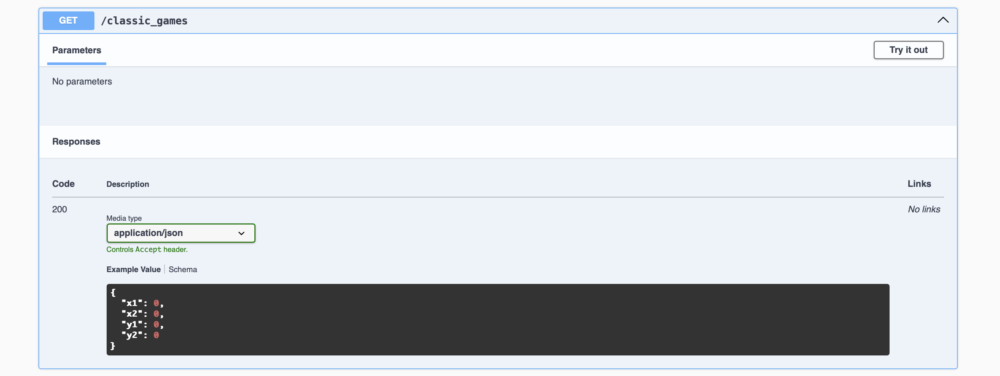

## Description

PopMasterr is a multiplayer trivia game where players compete to guess the population contained in various rectangeles showcased on a map. The game includes different modes such as streak games, classic games and multiplayer games. The population of the rectangle is found with prefix sums in another api.

Features:
- Classic Game: guess the population of a rectangle drawn on the map
- Streak Game: choose the rectangle with the bigger population and try to have a streak
- Multiplayer Game: guess the population in the rectangles and do it for multpile rounds. Moreover, you can see the scores of those who played before you
- Achievements: get achievements for playing
- Authentication: To play the game you have to create an account
- Images: upload/delete profile image

## Project setup

```bash
$ pnpm install
$ docker-compose up -d
```

## Compile and run the project

```bash
$ pnpm run start:dev
```

## Access the application

The application will be running at http://localhost:3000.
Swagger API documentation will be available at http://localhost:3000/api.

## Api documentation




## Tech stack

- Language: TypeScript
- Backend Framework: NestJS - A Node.js framework for building efficient, reliable, and scalable server-side applications.
- Database: MySQL - A relational database management system.
- ORM: TypeORM - An ORM for TypeScript.
- Authentication: Passport.js - A Node.js library for implementing authentication.


